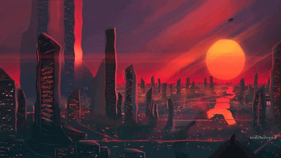
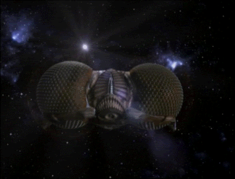
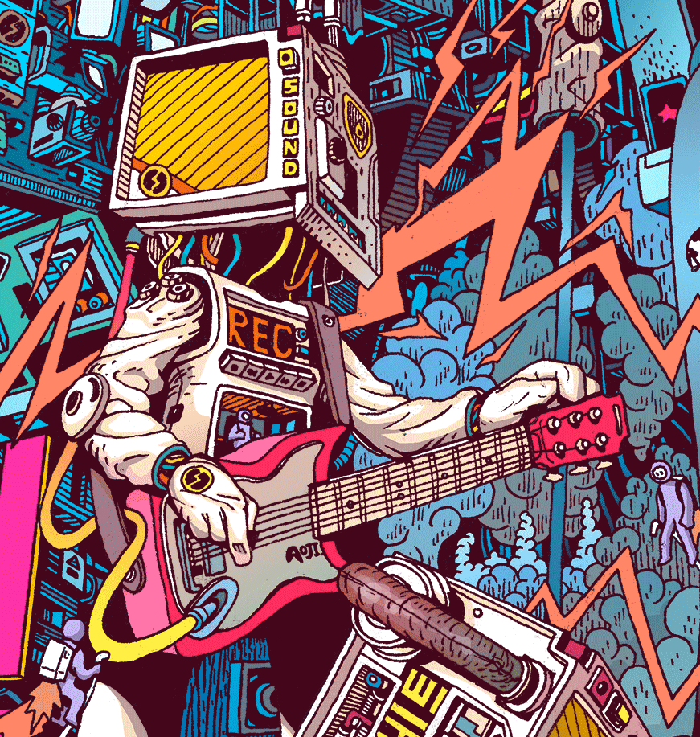

 ## Hi there 🙏
 
 

 
 
<!-- 

 -->

## About ME 🌌:

### - I'm Ruslan, Web Development Enthusiast.
___I dream to create something great!!!___

 

###  ✒️ Learning:
- 🚀 Web Design
- 🚀 Layout
- 🚀 Frontend Development

###  🎨 Hobbies :
- 🛸 Historical & philosophical books
- 🛸 Watching Movies
- 🛸 Play Guitar
- 🛸 Sailing

 
 
 
 
 

## Languages & Tools 👨‍💻 🛠:
 

  
 
 
 
 
 
  
 
 
 
 
  
 
 
 
  
 

<!-- For more icons please follow  https://github.com/MikeCodesDotNET/ColoredBadges -->

<!--

👨‍

<!--
**kobalt16/kobalt16** is a ✨ _special_ ✨ repository because its `README.md` (this file) appears on your GitHub profile.

Here are some ideas to get you started:

- 🔭 I’m currently working on ...
- 🌱 I’m currently learning ...
- 👯 I’m looking to collaborate on ...
- 🤔 I’m looking for help with ...
- 💬 Ask me about ...
- 📫 How to reach me: ...
- 😄 Pronouns: ...
- ⚡ Fun fact: ...
-->
